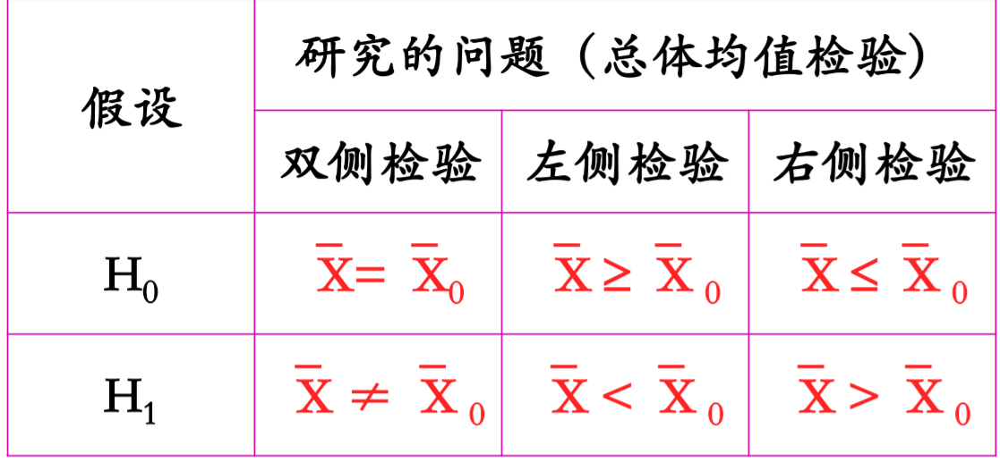

* content
{:toc}

参数估计和假设检验

**参数估计**( parameter estimation) 和 **假设检验 ** ( hypothesis testing) 是统计推断的两个组成部分，它们都是利用样本对总体进行某种推断，但推断的角度不同。参数估计讨论的是用样本统计量估计总体参数的方法，总体参数 $μ$ 在估计前是未知的。而在假设检验中，则是先对 $μ$ 的值提出一个假设，然后利用样本信息去检验这个假设是否成立。

**假设检验 **( hypothesis testing) 

包括参数和非参数检验：

- 参数假设检验（parametric test）：总体的 分布形式已知，需要对总体的未知参数进行 假设检验。
- 非参数假设检验（non-parametric test）：对 总体分布形式所知甚少，需对未知分布函数 的形式及其他特征进行假设检验。 

参数假设检验举例

> 例1: 根据1989年的统计资料，某地女性新生儿的平均体重为3190 克。为判断该地1990年的女性新生儿体重与1989年相比有无显 著差异，从该地1990年的女性新生儿中随机抽取30人，测得其 平均体重为3210克。从样本数据看，1990年女新生儿体重比 1989年略高，但这种差异可能是由于抽样的随机性带来的，也 许这两年新生儿的体重并没有显著差异。究竟是否存在显著差 异？可以先假设这两年新生儿的体重没有显著差异，然后利用 样本信息检验这个假设能否成立。这是一个关于总体均值的假 设检验问题。

假设检验的原理

小概率原理。假设检验 的基本思想是概率性质的**反证法**。(不同于纯数 学中的反证法)

什么是小概率？

- 概率是0～1之间的一个数，因此小概率就是接近0的一个 数 
-  著名的英国统计家 Ronald Fisher 把 20 分之 1 作为标准，也 就是0.05，从此0.05或比0.05小的概率都被认为是小概率 
-  Fisher没有任何深奥的理由解释他为什么选择0.05，只是 说他忽然想起来的

什么时小概率原理

- **小概率原理**——发生概率很小的随机事件（小概率事件） 在一次实验中几乎是不可能发生的。

- 根据这一原理，可以先假设总体参数的某项取值为真， 也就是假设其发生的可能性很大，然后抽取一个样本 进行观察，如果样本信息显示出现了与事先假设相反 的结果且与原假设差别很大，则说明原来假定的小概 率事件在一次实验中发生了，这是一个违背小概率原 理的不合理现象，因此有理由怀疑和拒绝原假设；否 则不能拒绝原假设。 
- 检验中使用的小概率是检验前人为指定的。

小概率原理举例

某工厂质检部门规定该厂产品次品率不超过4％方能 出厂。今从1000件产品中抽出10件，经检验有4件次 品，问这批产品是否能出厂? 

如果假设这批产品的次品率P≤4％，则可计算事件 “抽10件产品有4件次品”的出现概率为：
$$
\begin{equation}P_{10}(4)=C_{10}^{4}(0.04)^{4}(1-0.04)^{6}=0.00042\end{equation}
$$
可见，概率是相当小的，1万次实验中可能出现4次， 然而概率如此小的事件，在一次实验中居然发生了， 这是不合理的，而不合理的根源在于假设次品率 P≤4％ ，因而认为假设次品率P≤4％是不能成立的， 故按质检部门的规定，这批产品不能出厂。

假设检验的基本思想

假设检验的两个特点

- 第一，**假设检验采用逻辑上的反证法**，即为了检验 一个假设是否成立，首先假设它是真的，然后对 样本进行观察，如果发现出现了不合理现象，则 可以认为假设是不合理的，拒绝假设。否则可以 认为假设是合理的，接受假设。
- 第二，假设检验采用的反证法带有概率性。所谓假 设的不合理不是绝对的，而是基于实践中广泛采用的 小概率事件几乎不可能发生的原则。至于事件的概率 小到什么程度才算是小概率事件，并没有统一的界定 标准，而是必须根据具体问题而定。如果一旦判断失 误，错误地拒绝原假设会造成巨大损失，那么拒绝原 假设的概率就应定的小一些；如果一旦判断失误，错 误地接受原假设会造成巨大损失，那么拒绝原假设的 概率就应定的大一些。
- 小概率通常用 $α$ 表示，又称为**检验的显著性水平**。通 常取 $α$ ＝0.05 或 $α$ ＝0.01，即把概率不超过 0.05 或 0.01 的事 件当作小概率事件。

原假设和备择假设

假设检验中，我们称作为检验对象的待检验假 设为**原假设或零假设**，用 $H_0$表示。原假设的对立假设称为**备择假设或备选假设**，用 $H_1$表示。

若证明 $H_0$ 为真，则 $H_1$ 为假；若 $H_0$ 为假，则 $H_1$ 为真。

例如，设 $\bar{x}_0$ 为总体均值 $\bar{X}$ 的某一确定值。

（1）对于总体均值是否等于某一确定值的**原假设**可以表示为：
$$
\begin{equation}\mathrm{H}_{0}: \quad \mathrm{X}=\overline{\mathrm{X}}_{0} \quad\left(\text { 如 } \mathrm{H}_{0}: \quad \overline{\mathrm{X}}=3190 \text { 克 }\right)\end{equation}
$$
其对应的**备择假设**则表示为：
$$
\begin{equation}\mathrm{H}_{1}: \quad \mathrm{X} \neq \overline{\mathrm{X}}_{\mathrm{o}} \quad\left(\text { 如 } \mathrm{H}_{1}: \quad \overline{\mathrm{X}} \neq 3190\text { 克) }\right.\end{equation}
$$
（2）对于总体均值 $\bar{X}$ 是否大于某一确定值 $\bar{X}_0$  的**原假设**可以表示为：
$$
\begin{equation}\mathrm{H}_{\mathrm{o}}: \overline{\mathrm{X}} \geq \overline{\mathrm{X}}_{\mathrm{o}}\left(如\mathrm{H}_{\mathrm{o}}: \overline{\mathrm{X}} \geq 2000 \text { 克}\right)\end{equation}
$$
其对应的备择假设则表示为：
$$
\begin{equation}\mathrm{H}_{1}: \quad \overline{\mathrm{X}}<\overline{\mathrm{X}}_{\mathrm{o}} \quad\left(如\mathrm{H}_{1}: \quad \overline{\mathrm{X}}<2000 \text { 克}\right)\end{equation}
$$
（3）对于总体均值 $\bar{X}$ 是否小于某一确定值 $\bar{X}_0$   的原假设可以表示为：
$$
\begin{equation}\mathrm{H}_{0}: \quad \overline{\mathrm{X}} \leq \overline{\mathrm{X}}_{0} \quad\left(如\mathrm{H}_{0}: \quad \overline{\mathrm{X}} \leq 5 \%\right)\end{equation}
$$

其对应的备择假设则表示为：
$$
\begin{equation}\mathrm{H}_{1}: \quad \overline{\mathrm{X}}>\overline{\mathrm{X}}_{\mathrm{o}}\left(\text { 如 } \mathrm{H}_{1}: \quad \overline{\mathrm{X}}>5 \%\right)\end{equation}
$$
**注意：原假设总是有等号： $=$ 或 $≤$ 或 $≥$。** 

双侧检验和单侧检验

根据假设的形式不同，假设检验可以分为**双侧假设检验**和**单侧假设检验**。

双侧检验与单侧检验的(假设的形式)

